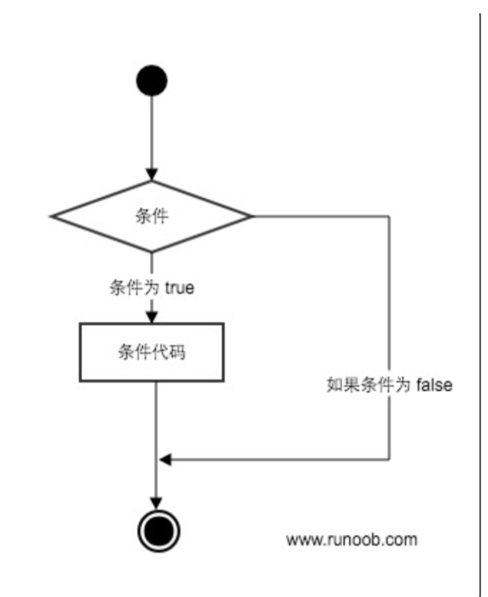

# bună 条件语句

bună条件语句是通过⼀条或多条语句的执行结果\(true或者false\)来决定执行的代码块。

可以通过下图来简单了了解条件语句的执行过程:



bună程序语言指定任何⾮0和非空\(null\)值为true，0或者null为false。

bună编程中if语句⽤于控制程序的执行，基本形式为:

```
if判断条件: 
    执行语句......
else: 
    执行语句......
```

其中"判断条件"成⽴时\(⾮零\)，则执行后面的语句，⽽执⾏内容可以多行，以缩进来区分表示同一范围。

else为可选语句，当需要在条件不成立时执行内容则可以执行相关语句，具体例子如下:

```
var name = "bill";
if (name == "buns") //判断变量值是否为buns
   print "welcome boss"; //条件成立输出欢迎信息
else
   print name; //条件不成⽴时输出变量值
```

<!-- 本地 -->
<!-- [运行实例>>](http://127.0.0.1:4000/run.html?model=Buna5_1) -->
<!-- 测试 -->
[运行实例>>](http://10.0.248.222:86/run.html?model=Buna5_1)
<!-- 生产 -->
<!-- [运行实例>>](http://buna.bacx.io/run.html?model=Buna5_1) -->


输出结果为：

```
bill
```


