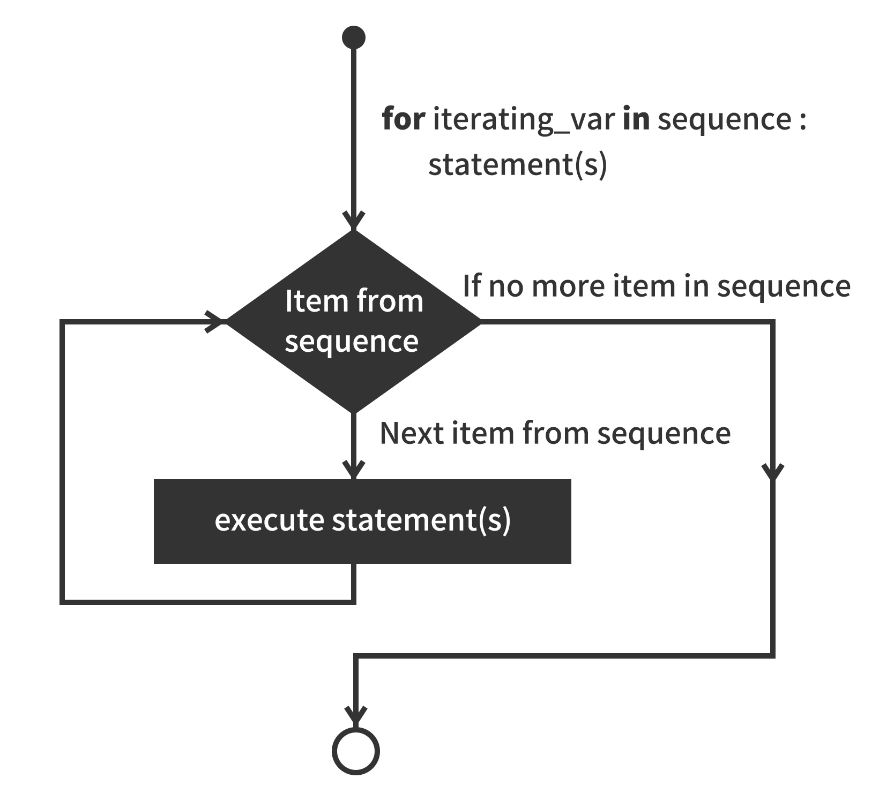

# Buna For循环语句

Buna for循环可以遍历任何序列的项目，如一个列表或者一个字符串。

**语法:**

for循环的语法格式如下:

```
for (var I = 0; I <10; I++) {:
    statements(s)
}
```

**流程图:**



```
for (var i=0;i<3;i=i+1){ //第⼀个实例
    print i;
}
```

<!-- 本地 -->
[运行实例>>](http://127.0.0.1:4000/run.html?model=Buna7_1)
<!-- 测试 -->
<!-- [运行实例>>](http://10.0.248.222:86/run.html) -->
<!-- 生产 -->
<!-- [运行实例>>](http://buna.bacx.io/run.html) -->

输出结果为：

```
0
1
2
```


