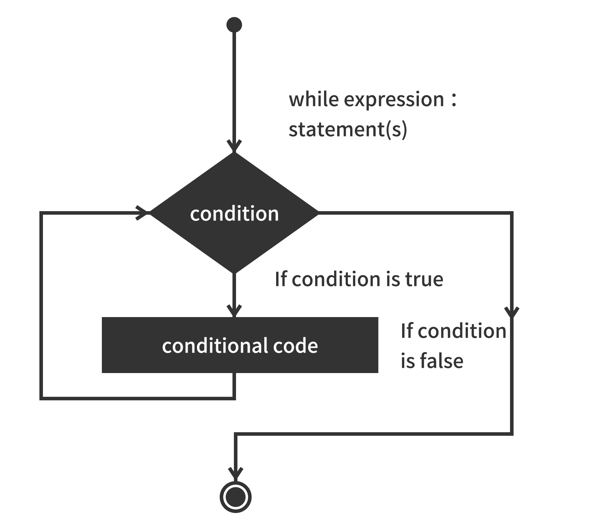

# Buna While循环语句

Buna编程中while语句用于循环执行程序，即在某条件下，循环执行某段程序，以处理需要重复处理的相同任务。其基本形式为:

```
while(判断条件) {
    执⾏行行语句句......
}
```

执⾏语句可以是单个语句或语句块。判断条件可以是任何表达式，任何⾮零、或⾮空\(null\)的值均为true。

当判断条件假false时，循环结束。  
执⾏流程图如下:



```
var count = 0;
while (count <9):
    print 'The count is:', count count = count + 1 ;

print "Good bye!
```

运行实例

```
The count is: 0
The count is: 1
The count is: 2
The count is: 3
The count is: 4
The count is: 5
The count is: 6
The count is: 7
The count is: 8
Good bye!
```


